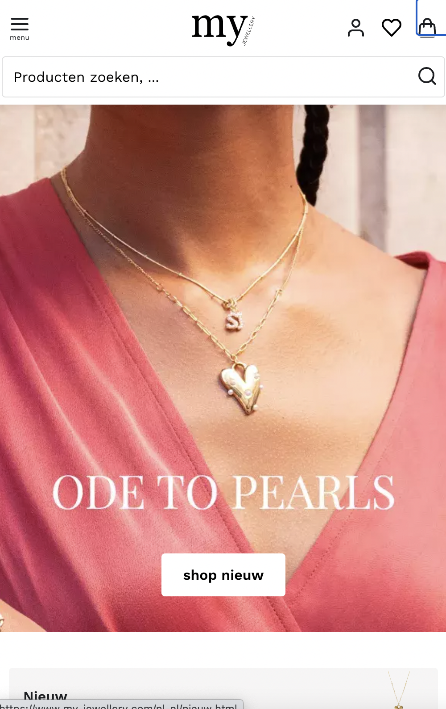
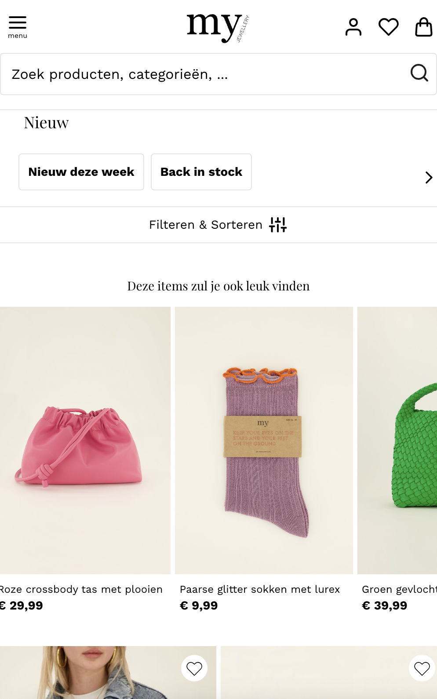
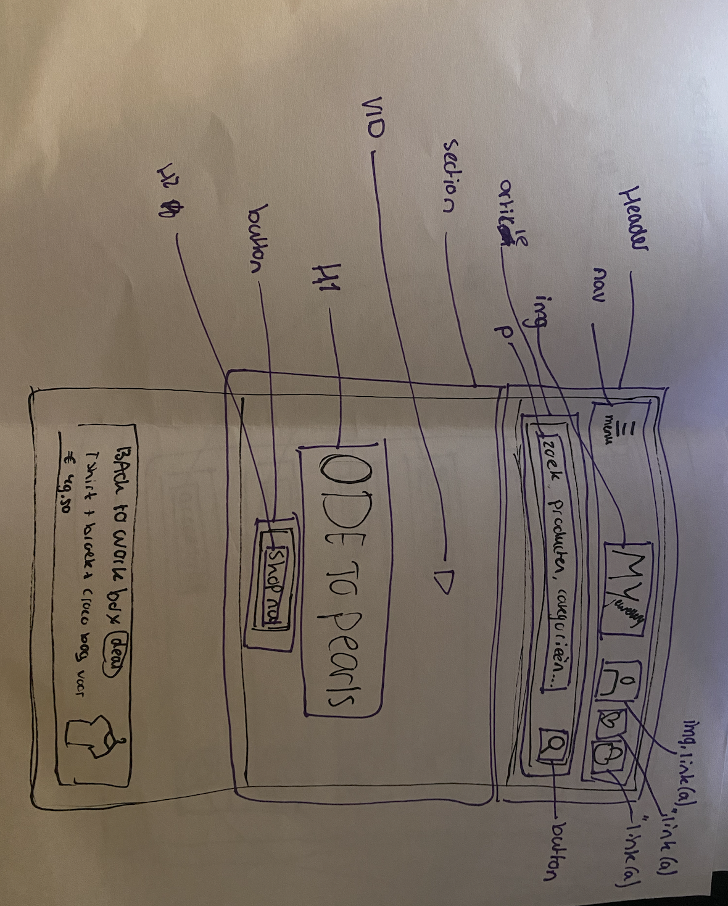
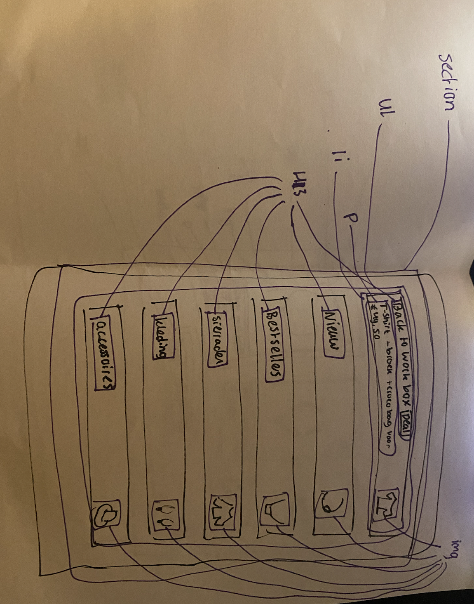
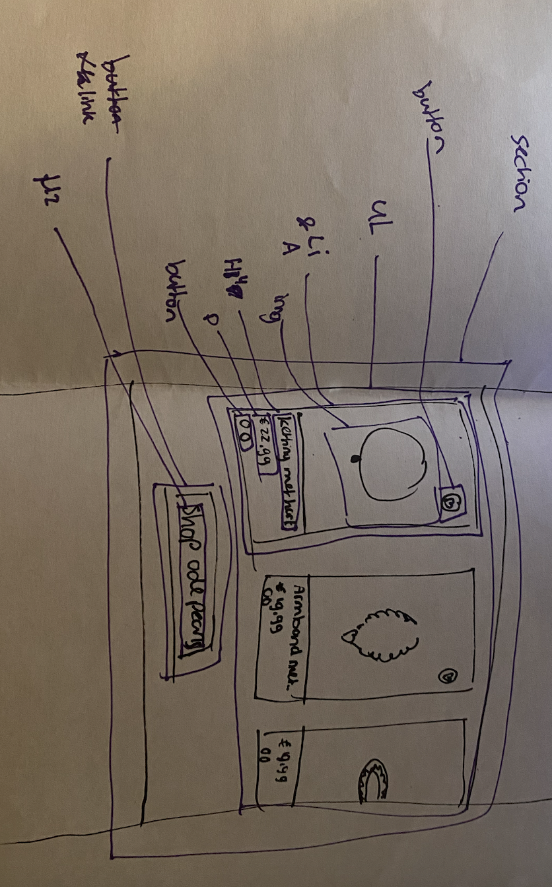
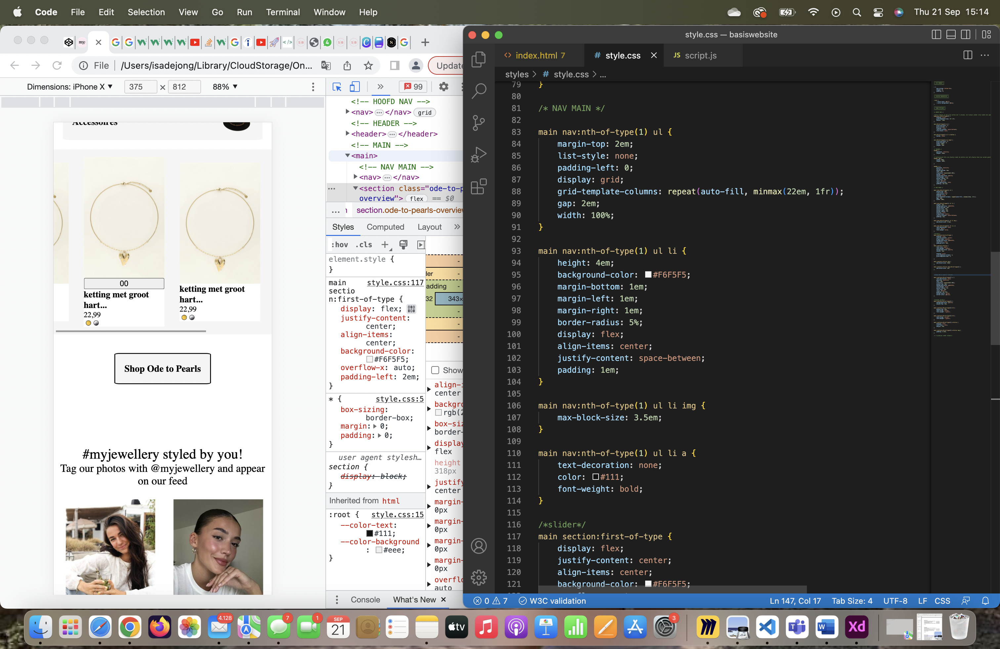
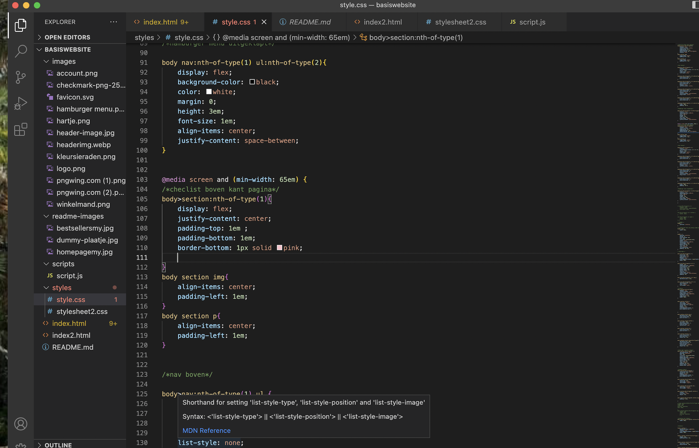
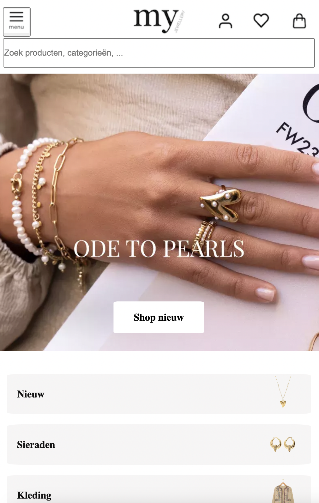
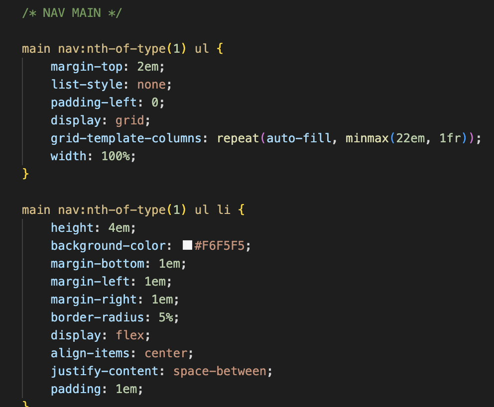
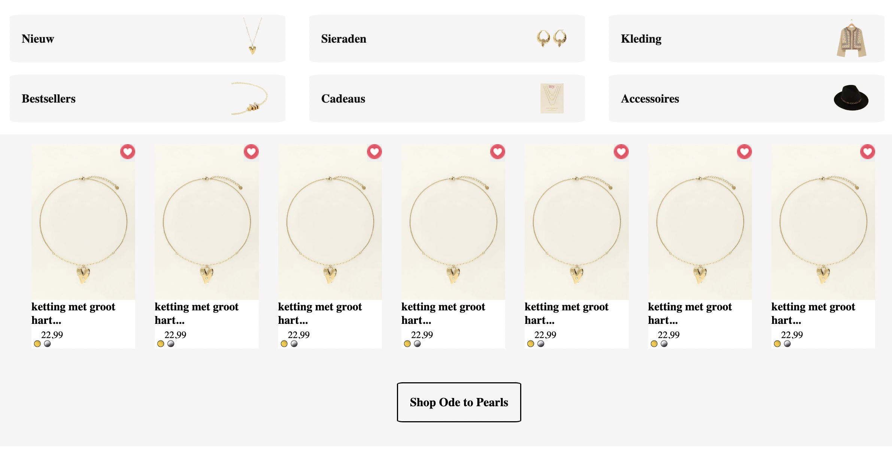

# Procesverslag
Markdown is een simpele manier om HTML te schrijven.  
Markdown cheat cheet: [Hulp bij het schrijven van Markdown](https://github.com/adam-p/markdown-here/wiki/Markdown-Cheatsheet).

Nb. De standaardstructuur en de spartaanse opmaak van de README.md zijn helemaal prima. Het gaat om de inhoud van je procesverslag. Besteedt de tijd voor pracht en praal aan je website.

Nb. Door *open* toe te voegen aan een *details* element kun je deze standaard open zetten. Fijn om dat steeds voor de relevante stuk(ken) te doen.

## Jij

  
uitwerken voor kick-off werkgroep

  ### Auteur:
  Isa de Jong (vervangen door jouw naam)

  #### Je startniveau:
  Blauw (kies uit zwart, rood óf blauw)

  #### Je focus:
  Voornamelijk responsive,  als dat goed is gelukt lijkt het mij leuk om ook een paar dingen uit te kiezen om uit te werken aan de surface plane.(kies uit responsive óf surface plane)

 

## Je website

  
uitwerken voor kick-off werkgroep

  ### Je opdracht:
  link naar de website die je gaat namaken óf de naam/omschrijving van je eigen ontwerp
  https://www.my-jewellery.com/nl-nl/bestsellers.html 

  #### Screenshot(s) van de eerste pagina (small screen): 
  De eerste pagina die ik ga  namaken is de home pagina.
    
  

  #### Screenshot(s) van de tweede pagina (small screen):
  Een andere pagina is de bestsellers pagina.
    
  
 

## Toegankelijkheidstest 1/2 (week 1)

  
uitwerken na test in 2e werkgroep

  ### Bevindingen
  Lijst met je bevindingen die in de test naar voren kwamen:
  
[FED 23-24 - Blok 1 - WCAG checklist-2.pdf](https://github.com/Isagithubb/blokwebb/files/12858672/FED.23-24.-.Blok.1.-.WCAG.checklist-2.pdf)

  - Erg veel fouten als ik het in de w3c validater doe.
  - qua layout is de site heel mooi en netjes
  - De html als ik op inspecteren klik bestaat uit super veel divjes etc.
  - 

## Breakdownschets (week 1)

  
uitwerken na afloop 3e werkgroep

  ### de hele pagina: 
  

  ### dynamisch deel (bijv menu): 
  

  ### wellicht nog een dynamisch deel (bijv filter): 
  

## Voortgang 1 (week 2)

  
uitwerken voor 1e voortgang

  ### Stand van zaken
  hier dit ging goed & dit was lastig (neem ook screenshots op van delen van je website en code)

  Wat goed gaat deze week is de html schrijen. ik vond het lastig om te begrijpen hoe een grid in elkaar zit en hoe je uiteindelijk een responsive website kon maken. Ik heb daarom veel grid garden gespeeld en video's over grid gekeken. 

 
 Op deze screenshot zie je een slider die ik heb gecodeerd zonder een grid te gebruiken.
 Ik hoop dat ik deze ul in een grid kan zetten, zodat het makkelijker responsive wordt en ik kan leren hoe ik een grid gebruik.
 
 Ook wil ik graag nog een hartjes button op de foto kan komen zodat het er helemaal af is dit gedeelte.

  ### Verslag van meeting
  hier na afloop snel de uitkomsten van de meeting vastleggen

  - veel proberen en opzoeken over grid
  - alle opdrachten goed doen
  - Hulp vragen aan de studentenassistent of de docent als het niet lukt om op weg te komen

## Voortgang 2 (week 3)

  
uitwerken voor 2e voortgang

  ### Stand van zaken
  hier dit ging goed & dit was lastig (neem ook screenshots op van delen van je website en code)

Wat erg goed gaat is dat ik een grid heb en het begrijp!! 

Daarnaast ben ik erachter gekomen hoe een media query werkt.
Ik heb geleerd dat sommige veranderingen op een pagina niet alleen door 100% responsive maken bestaan. Maar dus ook door te zeggen dat vanaf een bepaalde grootte het scherm en de html etc er anders uit moeten zien. Ik vond dit een erg interessant onderwerp, omdat ik door deze kennis ook nog oude kennis mee kon nemen. Bijvoorbeeld de display none functie. die kan je op een html element zetten en vervolgens laten verschijnen door display block in de media query te zetten.

Door al deze nieuwe informatie heb ik weer goede moed en weet ik hoe ik andere functies van mijn site moet gaan coderen. Bijvoorbeeld de footer. Hierdoor ben ik over het algemeen veel blijer met het resultaat wat ik nu heb! 

  ### Verslag van meeting
  hier na afloop snel de uitkomsten van de meeting vastleggen
  - Veel proberen, maakt niet uit als het niet in een keer lukt
  - Er zijn meerdere manieren om iets te bereiken, ik ga kijken wat de beste is voor mijzelf
  - Zelfstandig gaan knallen en uitproberen.
  - mediaquery gebruiken voor de footer.

## Toegankelijkheidstest 2/2 (week 4)

  
uitwerken na test in 9e werkgroep

  ### Bevindingen
  Lijst met je bevindingen die in de test naar voren kwamen (geef ook aan wat er verbeterd is):

 - Ik heb bijvoorbeeld alle alts geshreven 
 - Er is geen horizontale schuiving meer.
 - De website lijkt al op een geheel
 - ik zie soms niet het verschil met mijn website en de originele haha! 
 - Ik ben content met de informatie en hoe mijn html er uit ziet
 - Ik heb alle foto's niet gedownload maar de link van de website neergezet.

## Voortgang 3 (week 4)

  
uitwerken voor 3e voortgang

  ### Stand van zaken
  hier dit ging goed & dit was lastig (neem ook screenshots op van delen van je website en code)

Ik ben mijn 2e pagina goed gaan stylen met css en responsive maken. 
Ook ben ik alle puntjes op de i gaan zetten en heb ik een hamburger menu laten werken.
Voor de meeste tijd heb ik aan mijn 1e pagina gewerkt en gezeten. Dat gaf mij een beetje stress maar ik heb gelukkig nu wel veel kunnen veranderen aan de tweede pagina. 

  ### Verslag van meeting
  hier na afloop snel de uitkomsten van de meeting vastleggen
  - Niet opgeven lol
  - Veel tijd aan besteden en nog even strijden om zo veel mogelijk uit de komende week te halen

## Eindgesprek (week 5)

  
uitwerken voor eindgesprek

  ### Je uitkomst - karakteristiek screenshots:
  

  ### Dit ging goed/Heb ik geleerd: 
  Korte omschrijving met plaatjes:

  Waar ik erg trots op ben is dat ik echt heel veel heb geleerd deze weken. Ik begon met weinig tot basiskennis over een net html schrijven en ben nu op het punt dat ik geniet van code schrijven, omdat ik zo veel heb geleerd. een ding daarvan is bijvoorbeeld een grid kunnen gebruiken op verschillende manieren. 
     
  

  ### Dit was lastig/Is niet gelukt:
  Korte omschrijving met plaatjes

  Wat helaas niet is gelukt is het goed schalen van foto's of in dit geval een slider. 
     
  

## Bronnenlijst

  
continu bijhouden terwijl je werkt

  Nb. Wees specifiek ('css-tricks' als bron is bijv. niet specifiek genoeg). 
  Nb. ChatGpT en andere AI horen er ook bij.
  Nb. Vermeld de bronnen ook in je code.

  1. https://www.youtube.com/watch?v=D5eXOqrQHoM&t=203s
  2. https://www.youtube.com/watch?v=EiNiSFIPIQE&t=500s
  3. https://www.youtube.com/watch?v=jV8B24rSN5o&t=44s

